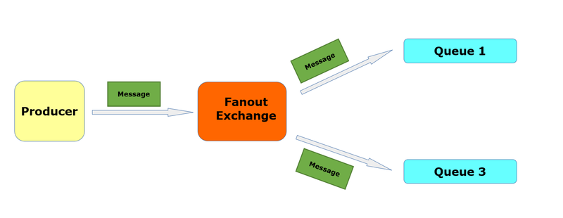
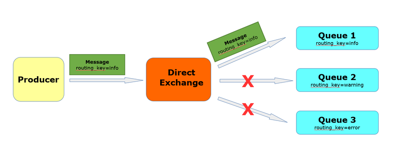
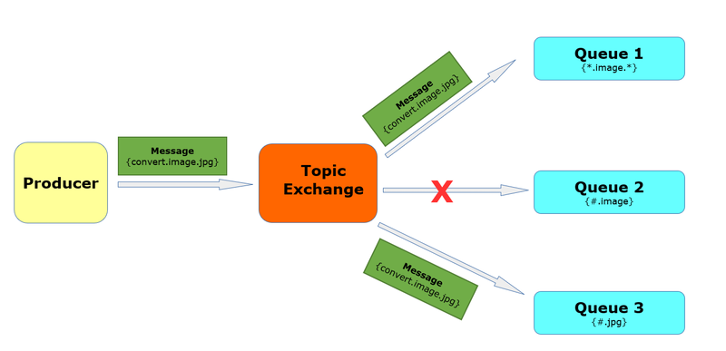
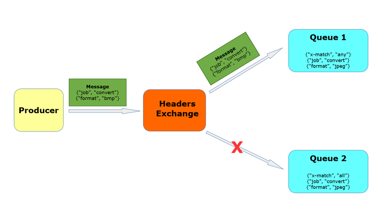
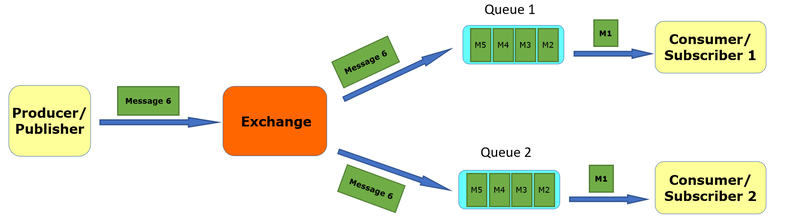
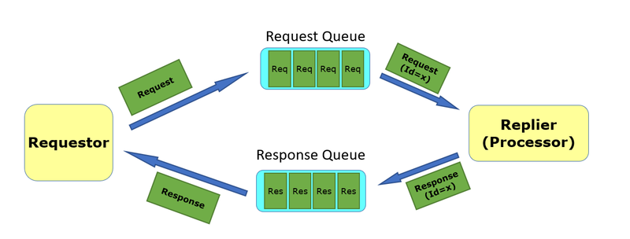

# RabbitSamples - A RabbitMQ Playground

## Exchange
- Exchanges are the message router of RabbitMQ.
- Producers send message to exchanges.
- Queues are bound to one or more exchanges with a binding
- Exchanges receive messages from producers and route them to zero or more queues, depending to the binding.
- There are four exchange types;
1. Fanout
2. Direct
3. Topic
4. Headers

### Fanout
- It sends all the messages it receives to all the queues that are bound to it. 

### Direct
- Routes messages to the queues based on the "routing key" specified in binding definition.

### Topic
- Routes messages to the queues based on a pattern of the "routing key" specified in binding definition.
- Available wild cards are as follows:
 #### \* (asterisk): Matches exactly one word 
> “*.image” will match “convert.image”, but not “convert.bitmap.image” or “image.jpg”

#### \# (hash): Matches zero or more words.
> “image.#” will match “image.jpg” and “image.bitmap.32bit” but not “convert.image”

### Header
- Routes messages to the queues based on the headers, ignoring the "routing key"
- “x-match” is the special header key whose value can be “all” or “any”. It determines the “match all” or “match any” logic for the matching process.

## Scenario

### Publish-Subscribe
- Publish-subscribe pattern is used to deliver the same message to one or more subscribers.
- There is one queue for each subscriber.
- Mostly used for event notifications.

### Request-Response (RPC)
- Used when the publisher of the message (requestor) needs to get the response for its message.
- There are two queues: 1 for the requests, 1 for the responses
- Mostly used for command\queries 

